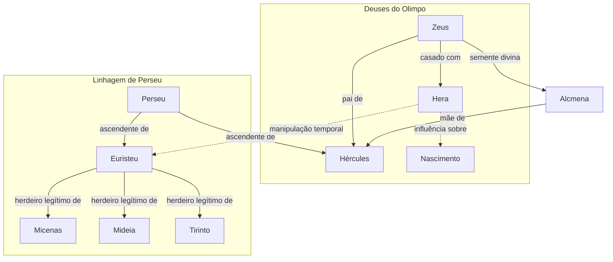

# 01. UM HERÓI LOUCO

## Resumo
No primeiro capítulo, somos apresentados ao destino dos descendentes de Perseu. Hera, temendo que Hércules lhe tirasse o trono de Micenas, Mideia e Tirinto, manipula o nascimento de Euristeu para que ele nasça alguns segundos antes. Enquanto Euristeu é criado como legítimo herdeiro, Hércules cresce célebre por sua inteligência. Decidida a eliminar a ameaça, Hera faz Hércules enlouquecer. Em um acesso de loucura, o herói mata seus próprios filhos, voltando depois, consumido pela dor e pelo remorso. Incapaz de compreender seus atos, decide consultar o Oráculo de Delfos em busca de redenção.

## Hierarquias

## Objetivo
Não se aplica a um dos trabalhos de Hércules.

## Quiz - 20250519_14:23:45
1. Qual era o destino previsto para a primeira criança nascida entre os descendentes de Perseu?
- a) Tornar-se rei de Tebas
- b) Tornar-se senhor de Micenas, Mideia e Tirinto
- c) Governar Esparta
- d) Liderar os argonautas

2. Como Hera garantiu que Euristeu nascesse antes de Hércules?
- a) Acelerando o parto de Alcmena
- b) Antecipando o nascimento de Euristeu
- c) Prendendo Hércules no útero
- d) Enviando mensagens proféticas

3. Quem era a mãe de Hércules?
- a) Hera
- b) Itaca
- c) Alcmena
- d) Megara

4. Qual divindade foi responsável pela loucura de Hércules?
- a) Hera
- b) Zeus
- c) Atena
- d) Apolo

5. Qual ato trágico Hércules cometeu durante sua loucura?
- a) Destruiu o templo de Apolo
- b) Feriu Euristeu
- c) Matou seus próprios filhos
- d) Invadiu o Olimpo

6. Para qual santuário Hércules viajou em busca de respostas?
- a) Delfos
- b) Olímpia
- c) Jerusalém
- d) Delos

7. Qual foi a principal justificativa de Hércules para negar a autoria do crime?
- a) Alegou ter sido enfeitiçado por Circe
- b) Disse ter dormido profundamente
- c) Afirmou estar perambulando e cansado
- d) Insinuou ter sido atacado por bestas

8. Quem sugeriu que Hércules consultasse o oráculo?
- a) Zeus
- b) O homem mais velho do conselho
- c) A sacerdotisa de Atena
- d) Euristeu

9. Como Mégara descobriu que Hércules era o autor dos assassinatos?
- a) Pelo oráculo de Delfos
- b) Por uma carta anônima
- c) Pela roupa manchada de sangue
- d) Por testemunha ocular

10. Qual personagem era considerado mais apto para governar as cidades?
- a) Zeus
- b) Euristeu
- c) Hércules
- d) Perseu

### Respostas do Quiz
1. b) Tornar-se senhor de Micenas, Mideia e Tirinto — era a profecia dada por Zeus.
2. b) Antecipando o nascimento de Euristeu — Hera atuou para que ele nascesse primeiro.
3. c) Alcmena — esposa mortal de Anfitrião e mãe de Hércules.
4. a) Hera — a deusa interferiu para que Hércules enlouquecesse.
5. c) Matou seus próprios filhos — ato central da tragédia.
6. a) Delfos — consultou o oráculo de Apolo em busca de redenção.
7. c) Afirmou estar perambulando e cansado — usou esse argumento para negar.
8. b) O homem mais velho do conselho — sugeriu a ida ao oráculo.
9. c) Pela roupa manchada de sangue — evidência incontestável.
10. c) Hércules — apesar de não herdeiro, era considerado mais apto.

## Challenge
Escreva um ensaio de 200 palavras sobre o papel de Hera na tragédia de Hércules, discutindo a tensão entre responsabilidade divina e responsabilidade humana.

### Resposta do Challenge
Hera personifica o conflito entre desejo divino e consequências humanas. Ao antecipar o nascimento de Euristeu, ela atua movida pelo ciúme, mas não antevê o custo emocional: o herói torna-se alvo de sua própria fúria e os inocentes pagam o preço. Essa ação divina coloca em cheque a noção de livre-arbítrio: Hércules, embora envolvido por forças que ele não controla, sofre a punição máxima. A manipulação de Hera revela a dualidade do poder: ser capaz de mudar destinos, mas sem considerar os danos colaterais. O ensaio deve discutir até que ponto os deuses são responsáveis por seus atos e onde reside a culpa humana quando instrumentos divinos destroem vidas.

## Tarô
**Carta:** XVIII (A Lua) — simboliza ilusão, confusão e instintos ocultos.
**Conceito de Krishnamurti:** Observação sem julgamento — compreender a própria mente e as influências externas para libertar-se de ilusões.