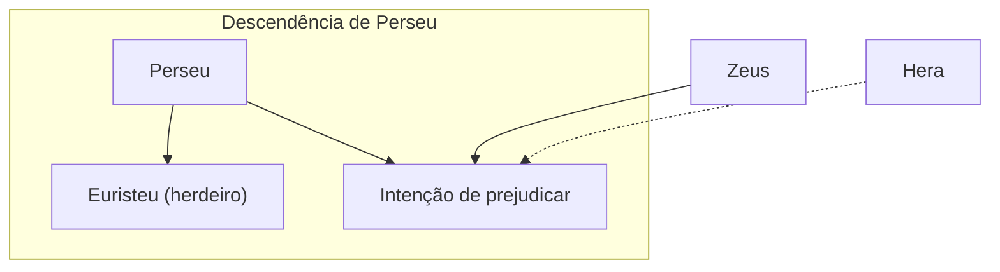

# 01.UM HERÓI LOUCO

## Resumo
Capítulo 1 narra a origem de Hércules: a profecia de Zeus sobre o primeiro descendente de Perseu, o favor concedido por Hera a Euristeu, e a intervenção divina que antecipou o nascimento de Euristeu e enlouqueceu Hércules. Tomado por fúria, Hércules cometeu um ato trágico contra sua família, motivando-o a buscar redenção no oráculo de Delfos.

## Hierarquias

## Objetivo
Este capítulo não corresponde a um dos doze trabalhos de Hércules, pois apresenta apenas o contexto de seu nascimento, loucura e busca por redenção.

## Quiz - 20250517_14:00:00
1. Qual profecia Zeus compartilhou com Hera?  
- a. Que o primeiro descendente de Perseu governaria Micenas, Mideia e Tirinto  
- b. Que Hércules seria o maior guerreiro da Grécia  
- c. Que Euristeu destruiria Tebas  
- d. Que Alcmena seria rainha de Olímpia  

2. Por que Hera antecipou o nascimento de Euristeu?  
- a. Para garantir que ele fosse o primeiro herdeiro  
- b. Para salvar Alcmena de Hera  
- c. Para impedir Hércules de nascer  
- d. Para fortalecer o poder de Zeus  

3. Quem é Alcmena no contexto da história?  
- a. Esposa de Euristeu  
- b. Mãe de Hércules  
- c. Sacerdotisa de Delfos  
- d. Filha de Creonte  

4. Qual foi o efeito da intervenção de Hera sobre Hércules?  
- a. Elevou sua força a níveis divinos  
- b. Fez com que ele enlouquecesse  
- c. Tornou-o imortal  
- d. Deixou-o cego  

5. Quem recomendou que Hércules consultasse o oráculo de Delfos?  
- a. A esposa Mégara  
- b. A sacerdotisa de Apolo  
- c. Um conselheiro do reino  
- d. Euristeu  

6. Qual tragédia marcou o destino imediato de Hércules?  
- a. A morte de Euristeu  
- b. O incêndio de Micenas  
- c. O assassinato de sua esposa e filhos  
- d. A perda de seus poderes  

7. Como as roupas de Hércules ajudaram a revelar sua culpa?  
- a. Estavam rasgadas  
- b. Exalavam perfume divino  
- c. Tinham manchas de sangue  
- d. Brilhavam como ouro  

8. Qual era a reação inicial de Hércules ao descobrir o crime?  
- a. Negou ter cometido o ato  
- b. Confessou imediatamente  
- c. Fugiu para o deserto  
- d. Matou-se de remorso  

9. Qual poder divina prendeu o estado de loucura de Hércules?  
- a. Zeus  
- b. Hera  
- c. Apolo  
- d. Atena  

10. Qual foi o propósito principal de Hércules ao buscar o oráculo de Delfos?  
- a. Pedir um novo reino  
- b. Buscar redenção pelo crime cometido  
- c. Recuperar seu poder divino  
- d. Desafiar Euristeu  

### Respostas e Explicações
1. a. Hera revelou que o primeiro descendente de Perseu governaria Micenas, Mideia e Tirinto, motivando sua intervenção.  
2. a. Ela antecipou o nascimento de Euristeu para garantir que ele fosse reconhecido como primeiro herdeiro.  
3. b. Alcmena é a mãe mortal de Hércules.  
4. b. A ação de Hera fez com que Hércules enlouquecesse.  
5. c. Um conselheiro do reino sugeriu que consultasse o oráculo de Delfos.  
6. c. Trágico assassinato de sua esposa Mégara e de seus filhos.  
7. c. As manchas de sangue em suas roupas denunciaram sua culpa.  
8. a. Inicialmente negou, alegando estar cansado e distante no momento do crime.  
9. b. Foi a intervenção de Hera que provocou sua loucura.  
10. b. Buscava redenção pelo crime infame que cometera.

## Challenge
Desafio: Explique em até 150 palavras como a intervenção de Hera no nascimento de Hércules e o consequente estado de loucura abordam questões de livre-arbítrio e responsabilidade divina.  
Resposta: A ação de Hera… (resposta breve)
