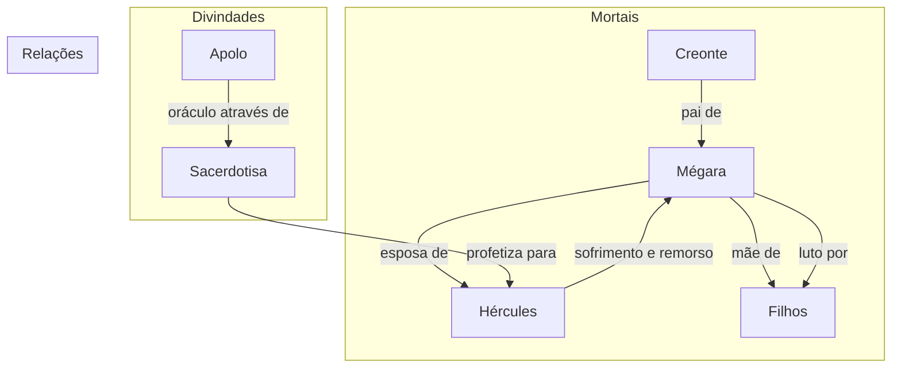

# 02. A VOZ DA PROFECIA

## Resumo
No segundo capítulo, acompanhamos o sofrimento de Mégara, filha de Creonte, ao descobrir que Hércules, em um acesso de loucura, matou seus próprios filhos. Incrédula frente à acusação, ela reluta em aceitar a responsabilidade do marido, mas a ama confirma o crime ao mostrar as roupas manchadas de sangue. Consumido pelo remorso e pela dor, Hércules é aconselhado pelo conselho tebano a consultar o oráculo de Apolo. Em Delfos, a sacerdotisa esclarece que jamais se esquecerá desse crime, mas indica a única forma de redenção: servir Euristeu e cumprir doze trabalhos em doze anos.

## Hierarquias

## Objetivo
Não se aplica a um dos trabalhos de Hércules.

## Quiz - 20250519_15:10:30
1. Quem era Mégara antes da tragédia envolvendo seus filhos?
- a) Sacerdotisa
- b) Filha de Creonte
- c) Esposa de Euristeu
- d) Rainha de Micenas

2. Qual era a relação entre Mégara e Creonte?
- a) Mãe e filha
- b) Irmãs
- c) Pai e filha
- d) Tia e sobrinha

3. Quem confirmou que Hércules matou seus filhos?
- a) A sacerdotisa de Delfos
- b) Um conselheiro
- c) A ama
- d) Creonte

4. Por que Hércules negava as acusações?
- a) Alegava ter sido enfeitiçado
- b) Alegava estar perambulando e cansado
- c) Dizia ter dormido profundamente
- d) Insinuava ter sido atacado por bestas

5. Qual evidência levou Mégara a acreditar em Hércules?
- a) Oráculo de Apolo
- b) Roupas manchadas de sangue
- c) Testemunha ocular
- d) Carta anônima

6. Quem sugeriu consultar o oráculo de Apolo?
- a) Mégara
- b) A sacerdotisa
- c) O homem mais velho do conselho
- d) Creonte

7. Que tragédia marcou este capítulo?
- a) Hércules foi exilado
- b) Perdeu a esposa
- c) Matou seus filhos em um acesso de loucura
- d) Enfrentou um leão

8. Qual foi o primeiro passo de Hércules após reconhecer seu crime?
- a) Fugir para o exílio
- b) Consultar o oráculo de Delfos
- c) Se vingar de Euristeu
- d) Reconstruir sua casa

9. O que a voz do oráculo afirmou sobre esquecer o crime?
- a) Seria fácil
- b) Jamais seria possível
- c) Ele já havia esquecido
- d) Seria rápido após penitência

10. Qual único caminho para a redenção indicado pelo oráculo?
- a) Construir um templo
- b) Sacrificar animais
- c) Servir Euristeu e realizar doze trabalhos
- d) Retornar a Tebas

### Respostas do Quiz
1. b) Filha de Creonte — Mégara era princesa tebana.
2. c) Pai e filha — Creonte era seu pai.
3. c) A ama — confirmou o ato mostrando as roupas manchadas.
4. b) Alegava estar perambulando e cansado — justificativa usada.
5. b) Roupas manchadas de sangue — evidência decisiva.
6. c) O homem mais velho do conselho — indicou consultar Apolo.
7. c) Matou seus filhos em um acesso de loucura — tragédia central.
8. b) Consultar o oráculo de Delfos — buscou explicação e perdão.
9. b) Jamais seria possível — oráculo enfatizou a dor permanente.
10. c) Servir Euristeu e realizar doze trabalhos — condição única de redenção.

## Challenge
Redija um texto de até 200 palavras analisando como a confirmação da ama e a reação de Mégara aprofundam o tema da responsabilidade individual versus a influência divina.

### Resposta do Challenge
A confirmação da ama e a reação de Mégara evidenciam o choque entre as forças externas que manipulam o destino e as escolhas pessoais diante das consequências. A ama, figura terrestre e simples, traz a verdade crua, deixando claro que não há desculpa plausível além do remorso de Hércules. Mégara, mesmo amedrontada pelos desígnios divinos, assume a dor humana de confrontar a realidade. Esse contraponto reforça a dualidade entre a vontade dos deuses — que lançou Hércules no caminho da tragédia — e a responsabilidade que lhe é atribuída como indivíduo. Embora influenciado por uma loucura divina, Hércules deve enfrentar seus atos, mostrando que a redenção exige ação consciente e reconhecimento do próprio erro.

## Tarô
**Carta:** V (O Hierofante) — simboliza autoridade espiritual, tradição e sabedoria.
**Conceito de Krishnamurti:** Autoridade interior — questionar crenças e condicionamentos para descobrir a verdade interna.