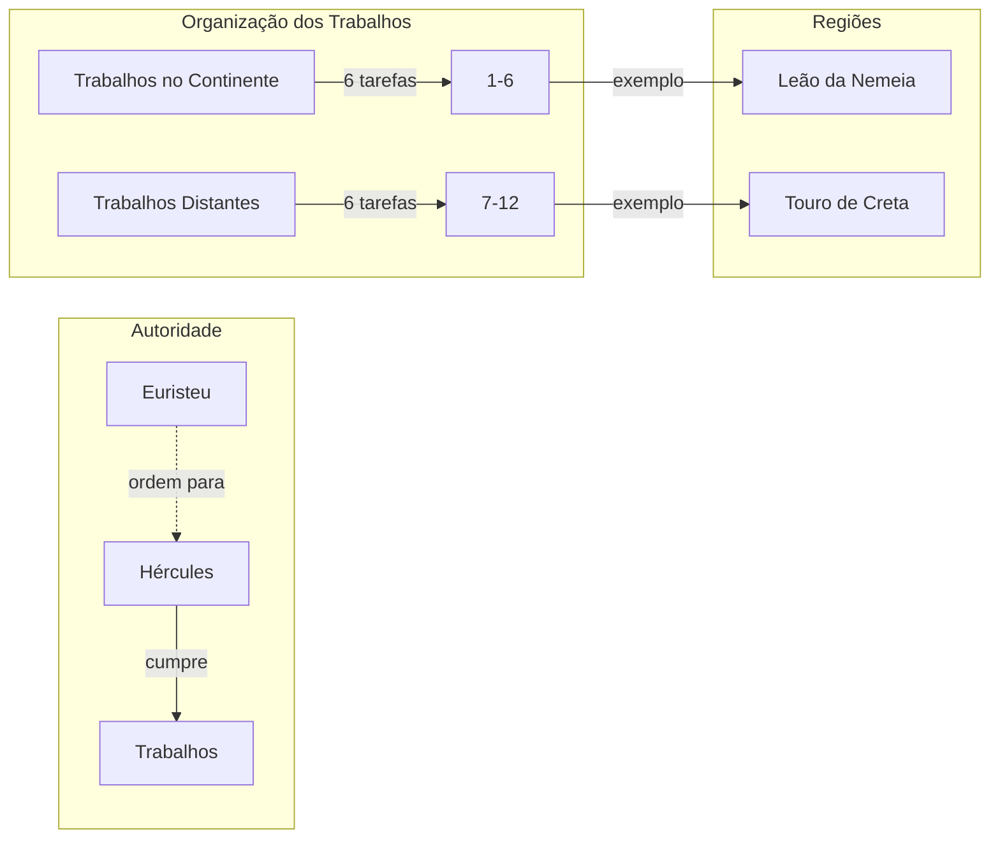

# 03. A SERVIÇO DE EURISTEU

## Resumo
No terceiro capítulo, Hércules comparece diante de Euristeu e toma conhecimento dos doze trabalhos que deverá cumprir para obter sua redenção. São listadas seis tarefas no continente grego e seis em regiões longínquas como Creta, Trácia, Cítia, Hespérides e Hades. Apesar da impossibilidade aparente, o herói não hesita em aceitar o desafio e parte determinado a cumprir cada missão, iniciando a jornada de provações que o afastará de sua família e testará sua coragem e habilidade.

## Hierarquias

## Objetivo
Não se aplica a um dos trabalhos isolados de Hércules; este capítulo estabelece o escopo dos doze trabalhos.

## Quiz - 20250519_15:30:12
1. Diante de quem Hércules teve de prestar contas para receber os trabalhos?
- a) Apolo
- b) Euristeu
- c) Creonte
- d) Zeus

2. Quantos trabalhos foram impostos a Hércules?
- a) 10
- b) 12
- c) 14
- d) 16

3. Quantas tarefas deveriam ser realizadas no continente grego?
- a) 4
- b) 6
- c) 8
- d) 12

4. Em quais regiões distantes incluíam-se tarefas?
- a) Atenas e Tebas
- b) Creta, Trácia, Cítia, Hespérides e Hades
- c) Roma e Cartago
- d) Ilhas de Sirenas

5. Qual era a condição para Hércules voltar a Argos e rever sua família?
- a) Construir um templo
- b) Realizar todos os trabalhos
- c) Derrotar um gigante
- d) Encontrar o oráculo de Delfos

6. Como Hércules reagiu ao saber da quantidade de trabalhos?
- a) Duvidou de sua força
- b) Aceitou sem hesitar
- c) Fugiu para o exílio
- d) Pediu ajuda dos deuses

7. Qual aspecto dos trabalhos é ressaltado neste capítulo?
- a) O aspecto diplomático
- b) A dificuldade e a localização variada
- c) A paz alcançada
- d) O luxo das recompensas

8. Quantos trabalhos deveriam ser feitos em territórios estrangeiros?
- a) 3
- b) 5
- c) 6
- d) 9

9. Quem sugeriu a forma de redenção que resultou nos trabalhos?
- a) A sacerdotisa de Delfos
- b) O homem mais velho do conselho
- c) Euristeu
- d) Zeus

10. Qual sentimento dominava Hércules ao aceitar as tarefas?
- a) Medo e hesitação
- b) Determinação e coragem
- c) Raiva e vingança
- d) Tristeza e desânimo

### Respostas do Quiz
1. b) Euristeu — era o rei que impôs os trabalhos.
2. b) 12 — ele deveria completar doze trabalhos.
3. b) 6 — metade das tarefas no continente.
4. b) Creta, Trácia, Cítia, Hespérides e Hades — regiões distantes mencionadas.
5. b) Realizar todos os trabalhos — condição para retornar.
6. b) Aceitou sem hesitar — confiava em sua força.
7. b) A dificuldade e a localização variada — foco nas provações.
8. c) 6 — seis tarefas em terras estrangeiras.
9. a) A sacerdotisa de Delfos — voz do oráculo estabeleceu a punição.
10. b) Determinação e coragem — pronto para enfrentar desafios.

## Challenge
Elabore um texto de até 200 palavras discutindo como a divisão geográfica dos trabalhos reflete o processo de transformação pessoal de Hércules.

### Resposta do Challenge
A divisão entre tarefas continentais e distantes simboliza o percurso interno de Hércules. As primeiras missões, acessíveis e próximas de sua terra natal, representam os primeiros passos de autodescoberta e expiação, quando encara monstros cujos perigos ele já conhece. As tarefas em regiões longínquas demandam enfrentar o desconhecido — e, consequentemente, as partes mais profundas de sua psique. Ao atravessar limites geográficos, Hércules expande seu universo interior, fortalecendo-se não apenas pela força física, mas pela resiliência emocional e adaptabilidade. Este processo reflete a jornada de autotransformação, onde cada etapa exige novas habilidades e uma visão ampliada de si mesmo.

## Tarô
**Carta:** VIII (A Força) — simboliza coragem, domínio dos instintos e perseverança.
**Conceito de Krishnamurti:** Autodomínio — observar e conter impulsos para agir com clareza e liberdade interna.
