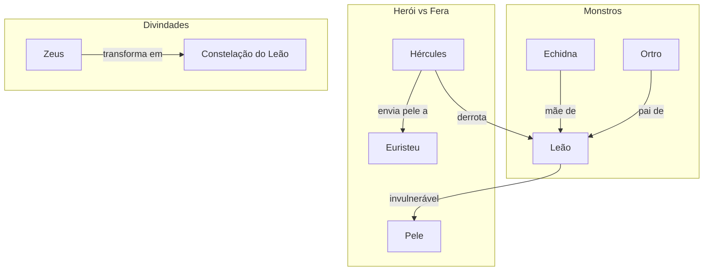

# 04. O LEÃO DA NEMEIA

## Resumo
Neste capítulo, Hércules enfrenta o primeiro dos doze trabalhos: o lendário Leão da Nemeia, cuja pele era invulnerável a qualquer arma. Após rastrear a fera até sua caverna de duas saídas, ele bloqueia uma passagem e, desarmado, imobiliza o monstro com um abraço mortal, quebrando seu pescoço com força sobre-humana. Com a vitória, envia a pele indestrutível a Euristeu e recebe a aprovação divina: Zeus transforma o leão em uma constelação para eternizar o feito.

## Hierarquias

## Objetivo
Realizar o primeiro trabalho: exterminar o Leão da Nemeia para provar sua força e iniciar sua expiação.

## Quiz - 20250519_15:45:00
1. Qual monstro Hércules enfrentou neste trabalho?
- a) Hidra de Lerna
- b) Leão da Nemeia
- c) Touro de Creta
- d) Cérbero

2. Quais as características da pele do leão?
- a) Macia e sedosa
- b) Invulnerável
- c) Inflamável
- d) Translúcida

3. Quem era pai do Leão da Nemeia?
- a) Cérbero
- b) Ortro
- c) Tifão
- d) Quimera

4. Quem era mãe do Leão da Nemeia?
- a) Cila
- b) Equidna
- c) Tétis
- d) Medusa

5. Como Hércules conseguiu imobilizar o leão?
- a) Envenenando-o
- b) Abraçando-o com força
- c) Afogando-o no riacho
- d) Cortando-o com espada

6. Que instrumento Hércules usou para o golpe inicial?
- a) Arco e flecha
- b) Lança
- c) Porrete pesado
- d) Espada

7. Onde o leão se refugiava?
- a) Torre de um castelo
- b) Caverna com duas saídas
- c) Floresta de espinheiros
- d) Vale profundo

8. Como Hércules impediu a fuga do leão pelas costas?
- a) Enterrou a única saída
- b) Rolou uma pedra fechando-a
- c) Posicionou-se na outra saída
- d) Chamou guardas

9. O que Zeus fez para homenagear o feito?
- a) Construiu um templo
- b) Transformou o leão em constelação
- c) Deu a ele uma espada divina
- d) Concedeu-lhe ambrosia

10. Por que este trabalho foi importante para Hércules?
- a) Foi o último trabalho
- b) Demonstrou sua astúcia e força
- c) Salvou Atenas
- d) Trouxe riquezas a Argos

### Respostas do Quiz
1. b) Leão da Nemeia — foi o monstro enfrentado.
2. b) Invulnerável — sua pele não podia ser penetrada.
3. b) Ortro — filho de Tifão e Equidna.
4. b) Equidna — mãe do Leão da Nemeia.
5. b) Abraçando-o com força — estrangulou até a morte.
6. c) Porrete pesado — usou após a flecha falhar.
7. b) Caverna com duas saídas — local do covil.
8. b) Rolou uma pedra fechando-a — bloqueou fuga.
9. b) Transformou o leão em constelação — para eternizar o feito.
10. b) Demonstrou sua astúcia e força — consolidou sua fama.

## Challenge
Escreva um parágrafo (até 200 palavras) explorando como a invulnerabilidade da pele do leão simboliza as barreiras internas de Hércules e de que modo o método de estrangulamento reflete a superação de aspectos impenetráveis de sua própria psique.

### Resposta do Challenge
A pele invulnerável do Leão da Nemeia simboliza as defesas psicológicas que nos impedem de confrontar nossas sombras mais profundas. Ao perceber que armas externas são inúteis, Hércules recorre ao abraço mortal — um gesto íntimo e direto — representando o enfrentamento interno sem artifícios. Esse método reflete a necessidade de romper defesas internas com determinação e presença plena, lembrando que a verdadeira transformação exige coragem para enfrentar o que é difícil de admitir.

## Tarô
**Carta:** VII (O Carro) — simboliza vitória, determinação e controle da vontade.
**Conceito de Krishnamurti:** Movimento consciente — agir com atenção e propósito para vencer desafios internos.
