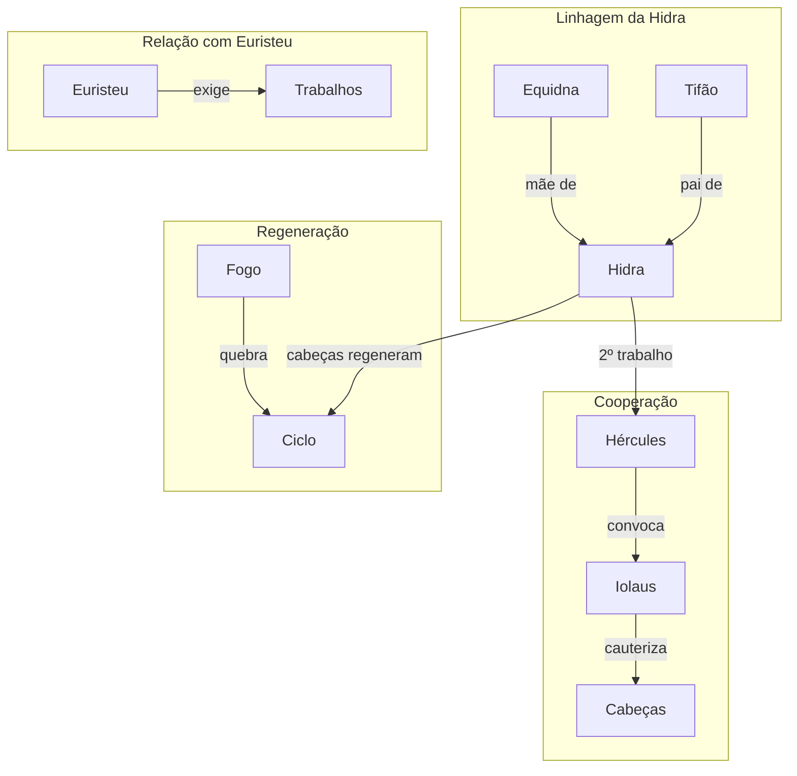

# 05. A HIDRA DE LERNA

## Resumo

Hércules é enviado a um pântano próximo a Argos para enfrentar a Hidra de Lerna, uma serpente monstruosa com cabeça humana e cem bocas venenosas, filha de Equidna e Tifão. Ao cortar cada cabeça de cobra, novas se regeneravam com o mesmo veneno, tornando o combate quase impossível. Hércules convoca seu sobrinho Iolaus, que o acompanha até o covil sombreado por um carvalho frondoso. Após decapitar a cabeça humana e aprisioná-la sob uma pedra num rochedo, Iolaus cauteriza os tocos das cabeças serpenteantes com fogo para impedir sua regeneração. Com a floresta em chamas, eles queimam as feridas, encerrando o ciclo de renascimento e completando o segundo trabalho.

## Hierarquias

## Objetivo

Completar o segundo trabalho: destruir a Hidra de Lerna e impedir a regeneração de suas cabeças.

## Quiz - 20250521_16:00:00

1. Onde vivia a Hidra de Lerna?

- a) Montanhas de Trácia
- b) Pântano próximo a Argos
- c) Caverna em Creta
- d) Florestas da Esparta

2. De quem a Hidra descendia?

- a) Cérbero e Medusa
- b) Equidna e Tifão
- c) Górgonas
- d) Quimera e Ortro

3. Qual característica tornava a Hidra tão perigosa?

- a) Pele invulnerável
- b) Cabeças regenerativas com veneno
- c) Presença de fogo interno
- d) Invisibilidade

4. Quem acompanhou Hércules na caçada?

- a) Euristeu
- b) Iolaus
- c) Mégara
- d) Apolo

5. Qual foi a tática inicial que falhou?

- a) Usar arco e flecha
- b) Afogar no pântano
- c) Ataque direto sem cauterização
- d) Invocar deuses

6. Como impediram a regeneração das cabeças?

- a) Mergulho na água sagrada
- b) Cauterização com fogo
- c) Uso de poção mágica
- d) Recitar encantamento

7. Onde colocaram a cabeça humana da Hidra?

- a) Enterrada no solo
- b) Prendida sob uma rocha
- c) Levantada em estandarte
- d) Queimada na tocha

8. O que fizeram após decapitar as cabeças menores?

- a) Usaram ervas curativas
- b) Atearam fogo na floresta
- c) Jogaram água no pântano
- d) Foram embora

9. Qual ambiente dificultava o combate?

- a) Deserto árido
- b) Pântano encharcado
- c) Caverna escura
- d) Vale gelado

10. Por que Hera criou a Hidra?

- a) Para proteger o Olimpo
- b) Para testar a coragem de Hércules
- c) Para atrasar a jornada de Hércules
- d) Para premiar Euristeu

### Respostas do Quiz

1. b) Pântano próximo a Argos — local onde a Hidra vivia.
2. b) Equidna e Tifão — pais mitológicos da criatura.
3. b) Cabeças regenerativas com veneno — aumentavam o perigo.
4. b) Iolaus — seu sobrinho e ajudante.
5. c) Ataque direto sem cauterização — falhou diante da regeneração.
6. b) Cauterização com fogo — impediu o renascimento.
7. b) Prendida sob uma rocha — forma de conter a cabeça humana.
8. b) Atearam fogo na floresta — cicatrizaram e interromperam o ciclo.
9. b) Pântano encharcado — dificultava mobilidade e visibilidade.
10. c) Para atrasar a jornada de Hércules — obra de Hera para atrapalhar.

## Challenge

Analise em até 200 palavras como a colaboração entre Hércules e Iolaus exemplifica a importância da ajuda mútua para superar desafios que parecem impossíveis isoladamente.

### Resposta do Challenge

A parceria entre Hércules e Iolaus demonstra que até o maior dos heróis depende do apoio de outros para vencer obstáculos complexos. Enquanto Hércules possuía força bruta e coragem, Iolaus trazia a astúcia de usar o fogo para cauterizar as feridas, impedindo a regeneração das cabeças. Essa cooperação simbólica mostra que a força individual, quando aliada à estratégia colaborativa, vence até adversários imortais. Juntos, transformam um impasse mortal em vitória, lembrando que a mútuo auxílio amplia capacidades e reduz limitações.

## Tarô

**Carta:** XIII (A Morte) — simboliza transformação profunda, fim de velhos padrões e renascimento.
**Conceito de Krishnamurti:** Observação da impermanência — compreender a natureza transitória para libertar-se de ciclos repetitivos.
