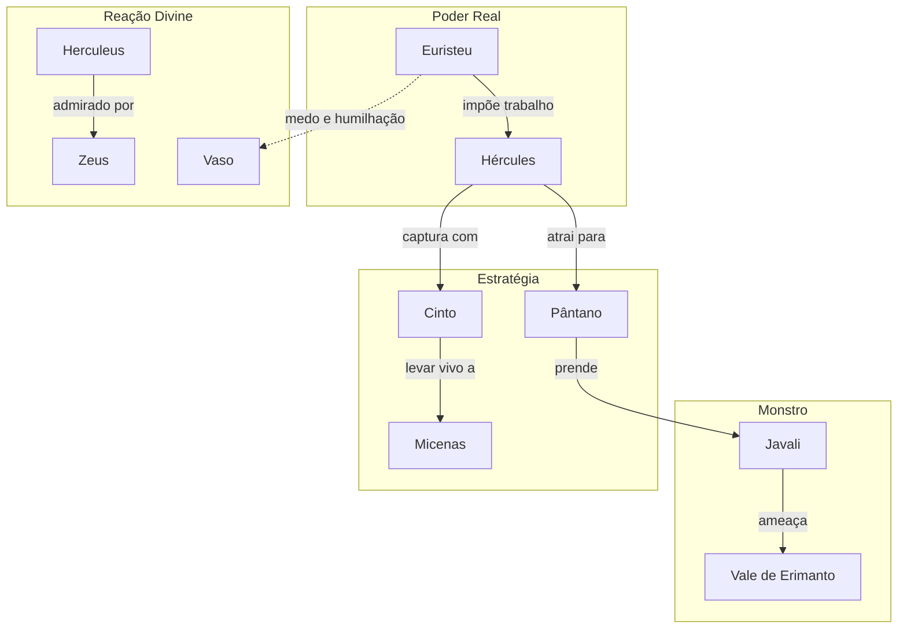

# 06. O JAVALI DE ERIMANTO

## Resumo

Hércules recebe seu terceiro trabalho: capturar vivo o temível Javali de Erimanto, que aterrorizava a confluência de Acaia, Arcádia e Élida. Usando a armadilha do pântano vermelho, ele atrai a fera para a lama profunda, onde a força do animal se esvai. Com astúcia, passa seu cinto ao redor do pescoço do javali e o conduz, humilhado, até Micenas. Ao apresentar o monstro a Euristeu, o rei se esconde em um vaso, reconhecendo a vitória do herói.

## Hierarquias

## Objetivo

Capturar o Javali de Erimanto vivo para provar astúcia e resistência, aprendendo a usar o ambiente em seu favor.

## Quiz - 20250521_16:30:00

1. Qual era o objetivo principal deste trabalho?

- a) Matar o javali
- b) Capturar o javali vivo
- c) Trazer sua pele como troféu
- d) Levar o javali ao Oráculo

2. Onde o javali aterrorizava as pessoas?

- a) Montanhas de Creta
- b) Confluência de Acaia, Arcádia e Élida
- c) Campos de Tebas
- d) Florestas de Diana

3. Qual armadilha Hércules usou para deter o javali?

- a) Rede de bronze
- b) Lamaçal do pântano
- c) Covil escuro
- d) Poço armado

4. Qual ferramenta Hércules utilizou para conter o javali?

- a) Espada afiada
- b) Lança longa
- c) Cinto de couro
- d) Correntes de ferro

5. Como o nivel de lama afetou a fera?

- a) Aumentou sua velocidade
- b) Cansou-a até imobilizar
- c) Inflamou a pele
- d) Escondeu o javali

6. Para onde Hércules levou o javali após capturá-lo?

- a) Floresta de Diana
- b) Vale de Lerna
- c) Micenas
- d) Delfos

7. Qual foi a reação de Euristeu ao ver o javali vivo?

- a) Aplaudiu e elogiou
- b) Fugiu e se escondeu num vaso
- c) Matou-o pessoalmente
- d) Ignorou o feito

8. Que lição de estratégia Hércules demonstra neste trabalho?

- a) Uso de força bruta sem reflexão
- b) Trabalho em equipe com Iolaus
- c) Aproveitar o terreno e clima desfavoráveis ao inimigo
- d) Invocar ajuda divina

9. Que importância tem capturar vivo em vez de matar?

- a) Demonstra compaixão pelos animais
- b) Satisfaz superstição local
- c) Prova controle e domínio sem destruir
- d) Facilita transporte do corpo

10. Qual aspecto mostra o aprendizado de Hércules neste trabalho?

- a) Vingança contra Euristeu
- b) Criação de armas novas
- c) Inteligência tática e adaptabilidade
- d) Dependência dos deuses

### Respostas do Quiz

1. b) Capturar o javali vivo — era a condição imposta.
2. b) Confluência de Acaia, Arcádia e Élida — região afetada.
3. b) Lamaçal do pântano — usou o pântano para cansá-lo.
4. c) Cinto de couro — transformou-o em coleira.
5. b) Cansou-a até imobilizar — lama dificultou o movimento.
6. c) Micenas — apresentou a Euristeu.
7. b) Fugiu e se escondeu num vaso — humilhado pelo feito.
8. c) Aproveitar o terreno e clima desfavoráveis ao inimigo — estratégia ambiental.
9. c) Prova controle e domínio sem destruir — valoriza a expiação.
10. c) Inteligência tática e adaptabilidade — aprendizado central.

## Challenge

Descreva em até 200 palavras como o uso do ambiente pelo herói exemplifica a importância de conhecer o terreno para vencer desafios aparentemente superiores.

### Resposta do Challenge

Ao atrair o Javali de Erimanto para o pântano enlameado, Hércules demonstra que a vitória muitas vezes não depende apenas de força física, mas de inteligência tática. O ambiente, considerado dificultador, torna-se arma quando compreendido: a lama esgota a resistência do monstro, nivelando forças. Ao usar seu cinto como coleira, ele reforça o controle sem recorrer à violência letal, evidenciando adaptação e respeito às regras do desafio. Esse trabalho ensina que reconhecer as condições externas e aproveitá-las a favor permite superar adversidades e revela a sabedoria de quem domina o cenário tanto quanto o oponente.

## Tarô

**Carta:** XI (A Justiça) — simboliza equilíbrio, verdade e consequência das ações.
**Conceito de Krishnamurti:** Responsabilidade pessoal — observar as próprias ações e seus efeitos sem negação.
