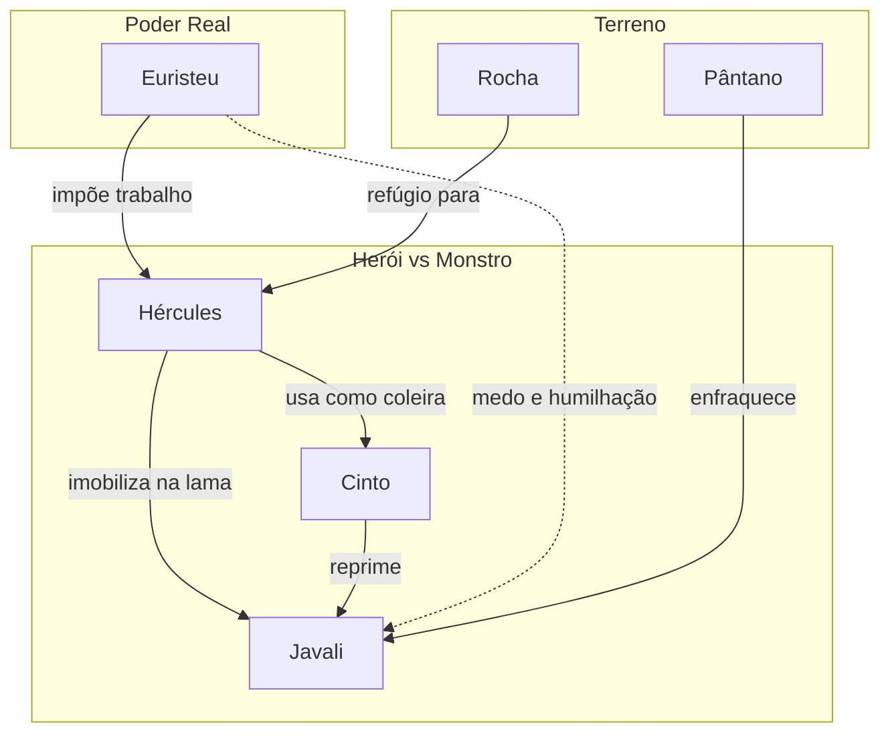

# 07. A COLEIRA DO JAVALI

## Resumo

Após imobilizar o Javali de Erimanto no lamaçal, Hércules renuncia à espada e transforma seu cinto de couro em uma coleira improvisada. Passando-a firmemente em torno do pescoço do monstro, conduz a fera exausta para a região seca e, com segurança, leva-o vivo até Micenas. Ao apresentar o animal a Euristeu, o rei, humilhado, busca refúgio em um grande vaso, reconhecendo a habilidade tática e o domínio do herói.

## Hierarquias

## Objetivo

Capturar vivo o Javali de Erimanto usando o próprio cinto como coleira, demonstrando astúcia e controle.

## Quiz - 20250521_17:00:00

1. Qual objeto Hércules utilizou como coleira para o javali?

- a) Cinto de couro
- b) Corrente de ferro
- c) Rede de cipós
- d) Laço de corda

2. Por que Hércules desistiu de usar a espada contra o javali?

- a) A lâmina quebrou
- b) Preferiu domar sem ferir
- c) A espada estava presa na lama
- d) A fera desviava os golpes

3. Onde o javali foi enfraquecido antes de receber a coleira?

- a) Na caverna escura
- b) No pântano enlameado
- c) Nas montanhas frias
- d) No bosque denso

4. Como o terreno contribuiu para a captura?

- a) Lama dificultava a movimentação do javali
- b) Rocha afiada impedia a fuga
- c) Rio profundo afogava a presa
- d) Todavia não teve influência

5. Como Euristeu reagiu ao ver o javali conduzido?

- a) Aplaudiu o feito
- b) Fugiu e se escondeu num vaso
- c) Encarou o monstro com ferocidade
- d) Matou o javali ele mesmo

6. Qual era o principal aprendizado deste método?

- a) A força bruta é suficiente
- b) O cinto é uma arma eficaz
- c) Domínio e estratégia valem mais que violência
- d) Sempre usar armadilhas grandes

7. Qual sensação dominou o javali quando foi preso?

- a) Raiva crescente
- b) Medo e exaustão
- c) Confiança enganosa
- d) Estado de transe

8. Onde Hércules se abrigou para desafiar o javali?

- a) Dentro de um vaso
- b) Sobre uma rocha segura
- c) Na margem do rio
- d) Debaixo de uma árvore

9. Por que é significativo levar a fera viva até o rei?

- a) Para provar humilhação pública de Euristeu
- b) Para alimentar o povo
- c) Para vender no mercado
- d) Para oferecer sacrifício aos deuses

10. Qual característica do herói fica evidenciada nesta ação?

- a) Paciência e astúcia
- b) Força desmedida
- c) Dependência de armas
- d) Vingança sanguinária

### Respostas do Quiz

1. a) Cinto de couro — improvisado como coleira.
2. b) Preferiu domar sem ferir — capturar vivo era o objetivo.
3. b) No pântano enlameado — terreno que exauriu a fera.
4. a) Lama dificultava a movimentação do javali — enfraqueceu-o.
5. b) Fugiu e se escondeu num vaso — humilhado pelo feito.
6. c) Domínio e estratégia valem mais que violência — lição central.
7. b) Medo e exaustão — resultado da armadilha.
8. b) Sobre uma rocha segura — posição vantajosa.
9. a) Para provar humilhação pública de Euristeu — demonstração de poder.
10. a) Paciência e astúcia — destaque na ação.

## Challenge

Discorra em até 200 palavras sobre como a improvisação com o cinto ilustra a importância de adaptar recursos pessoais para resolver problemas complexos.

### Resposta do Challenge

A escolha de usar o próprio cinto como coleira demonstra que a criatividade e a capacidade de adaptação são fundamentais diante de situações adversas. Em vez de recorrer à violência letal ou depender apenas da força física, Hércules utiliza um item cotidiano para estabelecer controle sobre uma criatura feroz. Essa improvisação enfatiza que o verdadeiro valor de um herói não está apenas em seu poder bruto, mas na habilidade de transformar limitações em soluções eficientes. Aproveitar recursos disponíveis com engenhosidade assegura resultados duradouros e evita danos desnecessários, reforçando o princípio de que a mente estratégica pode superar desafios que a força isolada não venceria.

## Tarô

**Carta:** II (A Sacerdotisa) — simboliza intuição, sabedoria e uso do inconsciente.
**Conceito de Krishnamurti:** Ação consciente — agir com atenção plena e confiança na intuição interna.
