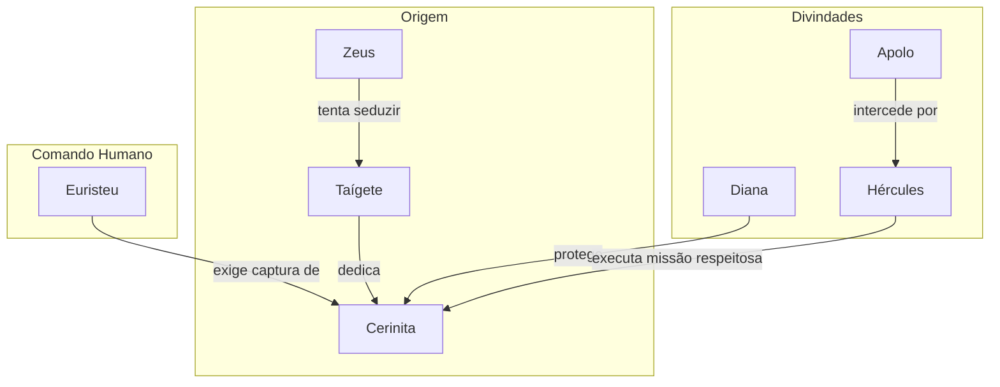

# 08. A CERVA DE DIANA

## Resumo

Euristeu impõe a Hércules a missão de capturar Cerinita, a cerva sagrada de Diana, presente de Taígete com pés de bronze e chifres de ouro. Consciente de que tocar no animal seria ofender a deusa, Hércules hesita até que, ao ver Cerinita ferida no rio Ladão, a salva da morte e a conduz com respeito. Interceptado por Diana e Apolo, explica que agiu sob ordens de Euristeu para expiar seu crime. Como reconhecimento de sua impossibilidade de escolha, os deuses perdoam sua ação e instruem que ele leve a cerva ilesa até o palácio, cumprindo assim o quarto trabalho.

## Hierarquias

## Objetivo

Realizar o quarto trabalho: capturar viva a cerva Cerinita sem ofender sua sacralidade e entregá-la a Euristeu.

## Quiz - 20250521_17:15:00

1. Quem dedicou Cerinita a Diana?

- a) Taígete
- b) Euristeu
- c) Mégara
- d) Alcmena

2. Quais atributos físicos Cerinita possuía?

- a) Pés de ferro e chifres de prata
- b) Pés de bronze e chifres de ouro
- c) Pele impenetrável e asas
- d) Olhos de fogo

3. Por que Hércules hesitou em realizar o trabalho?

- a) Temia não encontrá-la
- b) Sabia que a cerva era sagrada
- c) Faltava ordem de Zeus
- d) Não acreditava em profecias

4. Como Cerinita quase morreu?

- a) Queda de penhasco
- b) Afogamento no rio Ladão após ser ferida
- c) Ataque de lobos
- d) Incêndio na floresta

5. Quem interveio ao encontrar Hércules com a cerva?

- a) Atena e Hermes
- b) Diana e Apolo
- c) Hera e Poseidon
- d) Deméter e Ártemis

6. Qual justificação Hércules deu aos deuses?

- a) Agiu por prazer de caça
- b) Seguiu ordens de Euristeu para expiar seu crime
- c) Queria testar seus próprios limites
- d) Desejava presentear Perséfone

7. Qual foi a resposta dos deuses?

- a) Puniram-no com mais trabalhos
- b) Perdoaram sua ação e instruíram a levar a cerva viva
- c) Retiraram-lhe os poderes divinos
- d) Ordenaram que devolvesse a cerva ao rio

8. Onde Cerinita vivia?

- a) Vale de Lerna
- b) Florestas de Nemeia
- c) Enóue, na Arcádia
- d) Montanhas de Trácia

9. Qual elemento simboliza o dilema moral do herói?

- a) A espada enferrujada
- b) A placa no pescoço da cerva
- c) A flecha quebrada
- d) A tocha apagada

10. Por que este trabalho é único entre os primeiros quatro?

- a) Envolve um ser sagrado em vez de um monstro feroz
- b) É o mais fácil de todos
- c) Requer força maior que os outros
- d) É o único que não exige redenção

### Respostas do Quiz

1. a) Taígete — ofereceu a cerva a Diana.
2. b) Pés de bronze e chifres de ouro — descrição dada por Euristeu.
3. b) Sabia que a cerva era sagrada — risco de ofender a deusa.
4. b) Afogamento no rio Ladão após ser ferida — momento crítico.
5. b) Diana e Apolo — intervieram para perdoar Hércules.
6. b) Seguiu ordens de Euristeu para expiar seu crime — justificativa.
7. b) Perdoaram sua ação e instruíram a levar a cerva viva — perdão divino.
8. c) Enóue, na Arcádia — local de Cerinita.
9. b) A placa no pescoço da cerva — prova de sacralidade.
10. a) Envolve um ser sagrado em vez de um monstro feroz — singularidade.

## Challenge

Refita em até 200 palavras sobre o conflito entre obediência a ordens humanas e respeito às leis divinas presente neste capítulo.

### Resposta do Challenge

O quarto trabalho evidencia a tensão entre a vontade humana, representada por Euristeu, e as leis divinas, manifestas na sacralidade de Cerinita. Ao obedecer à ordem de capturar a cerva, Hércules se vê diante de um dilema moral: comete um ato que ofende a deusa da caça ou assume a pena eterna dos filhos mortos. A intervenção de Diana e Apolo revela que, mesmo em obediência, é possível conciliar deveres conflitantes por meio da intenção e do respeito, demonstrando que a retidão moral reside na consciência, não apenas na ação cega às ordens.

## Tarô

**Carta:** XII (O Pendurado) — simboliza sacrifício, renúncia e nova perspectiva.
**Conceito de Krishnamurti:** Renúncia ao condicionamento — libertar-se de velhas crenças ao observar sem preconceitos.
