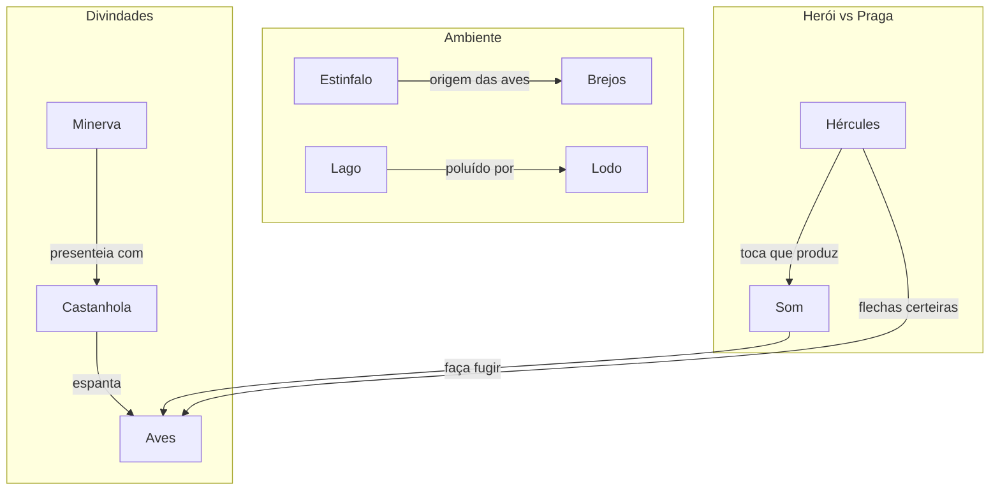

# 09. OS PÁSSAROS DE ESTÍNFALO

## Resumo

Neste capítulo, Hércules enfrenta a praga das aves de Estínfalo, que migraram em nuvens famintas dos brejos do lago malcheiroso para devastar plantações. Após investigar a causa – o lago coberto de lodo e mortos – o herói deduz que não bastaria persegui-las no bosque. Minerva lhe presenteou uma castanhola de bronze, que emite som estridente: ao tocá-la, Hércules assusta as aves, expulsando-as dos galhos. Livre no céu, cada bando torna-se alvo fácil para suas flechas certeiras. Com habilidade e velocidade, ele abate a legião de pássaros e recolhe os corpos, cumprindo o nono trabalho.

## Hierarquias

## Objetivo

Expulsar e abater as aves de Estínfalo, livrando os campos da praga.

## Quiz - 20250521_17:30:00

1. De onde migraram as aves para os bosques e plantações?

- a) Montanhas de Trácia
- b) Brejos do lago Estínfalo
- c) Ilhas de Creta
- d) Desertos de Élida

2. Qual característica chamava atenção nas penas das aves?

- a) Cores vivas e brilhantes
- b) Cores sujas e som rouco
- c) Plumas translúcidas
- d) Asas de metal

3. O que fazia o lago Estínfalo antes da praga?

- a) Era famoso pela pesca
- b) Era coberto de lodo e corpos em decomposição
- c) Servia de fonte de águas curativas
- d) Acolhia peregrinos

4. Qual foi o presente que Minerva deu a Hércules?

- a) Um arco invulnerável
- b) Uma castanhola de bronze
- c) Um escudo reluzente
- d) Uma espada afiada

5. Como o som da castanhola ajudou no trabalho?

- a) Aves ficaram curiosas e pousaram
- b) Aves se assustaram e abandonaram o bosque
- c) Lobos vieram distrair as aves
- d) O som apaziguou a água do lago

6. O que Hércules fez quando as aves saíram dos galhos?

- a) Usou redes para capturá-las
- b) Usou flechas certeiras para abatê-las
- c) Correu atrás delas a pé
- d) Cantou para atrair mais aves

7. Como o herói recolheu os corpos das aves?

- a) Com uma enorme cesta de cipós
- b) Em sacos de couro
- c) Em caixas de madeira
- d) Em redes de pesca

8. Qual lição estratégica este trabalho exemplifica?

- a) A força bruta sempre vence
- b) Uso de inteligência e presentes divinos
- c) Depender exclusivamente dos deuses
- d) Evitar confrontos diretos

9. Por que não bastava caçar aves no bosque?

- a) Eram invisíveis entre as árvores
- b) Havia tribos hostis no bosque
- c) Precisavam atrair as aves para área aberta
- d) As flechas não atravessavam galhos

10. Qual aspecto da praga afetava a população?

- a) Destruição de templos
- b) Devastação de plantações e fome iminente
- c) Invasão de monstros aquáticos
- d) Epidemia de febre alta

### Respostas do Quiz

1. b) Brejos do lago Estínfalo — origem das aves.
2. b) Cores sujas e som rouco — descrição de suas penas e canto.
3. b) Era coberto de lodo e corpos em decomposição — causa da migração.
4. b) Uma castanhola de bronze — presente de Minerva.
5. b) Aves se assustaram e abandonaram o bosque — efeito do som.
6. b) Usou flechas certeiras para abatê-las — estratégia de ataque.
7. a) Com uma enorme cesta de cipós — para recolher os corpos.
8. b) Uso de inteligência e presentes divinos — lição central.
9. c) Precisavam atrair as aves para área aberta — estratégia.
10. b) Devastação de plantações e fome iminente — impacto social.

## Challenge

Explique em até 200 palavras como a combinação de presente divino e engenhosidade humana permitiu a Hércules solucionar um problema em grande escala.

### Resposta do Challenge

Hércules enfrentou uma praga que ameaçava a subsistência das comunidades, algo além do poder da força bruta. Ao receber de Minerva a castanhola de bronze, ele combinou o recurso divino com sua própria iniciativa: entendeu que o som estridente seria mais eficaz do que flechas em meio ao bosque denso. Essa sinergia entre dádiva celestial e pensamento estratégico ilustra que, mesmo heróis devem aliar dons superiores à criatividade humana. A ação demonstra que soluções sustentáveis e em larga escala surgem quando se aproveita o que está disponível com sabedoria, valorizando a complementaridade entre o divino e o mundano.

## Tarô

**Carta:** XVI (A Torre) — simboliza ruptura, transformação súbita e limpeza de velhos padrões.
**Conceito de Krishnamurti:** Observação da impermanência — reconhecer que estruturas podem desmoronar para dar lugar ao novo.
