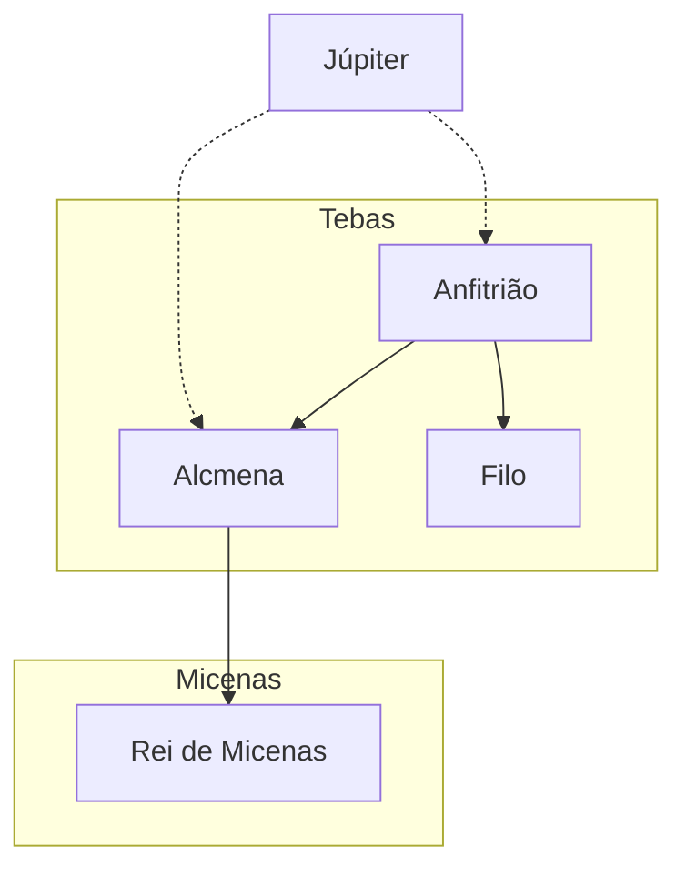

**Resumo**
O capítulo "Uma ou Duas Artimanhas de Júpiter" descreve uma noite em que a cidade de Tebas está vulnerável devido à ausência de seus guerreiros, liderados pelo rei Anfitrião, que partiu para combater os telebeus. Durante a noite, um cavaleiro misterioso aparece, causando alarme entre os guardas. O cavaleiro é revelado como o próprio Anfitrião, que retorna inesperadamente para visitar sua esposa, Alcmena. No entanto, há um clima de desconfiança e mistério, pois o comportamento de Anfitrião parece incomum, sugerindo que algo mais está em jogo.

**Hierarquias**

**Objetivo**
Este capítulo não descreve diretamente um dos trabalhos de Hércules, mas estabelece o contexto para o nascimento do herói, envolvendo a intervenção de Júpiter e a relação entre Anfitrião e Alcmena. A importância está em introduzir os eventos que levarão ao surgimento de Hércules como um semideus.

**Quiz**
*Quiz - 20250511_15:30:00*
1. Quem estava ausente da cidade de Tebas no início do capítulo?
   - a) Alcmena
   - b) Anfitrião
   - c) Júpiter
   - d) Filo

2. Qual era a ameaça enfrentada por Tebas?
   - a) Um ataque dos telebeus
   - b) Uma invasão de Micenas
   - c) Um ataque de monstros
   - d) Uma revolta interna

3. Quem era o cavaleiro misterioso que apareceu durante a noite?
   - a) Júpiter
   - b) Anfitrião
   - c) Filo
   - d) Um telebeu

4. Qual era a relação entre Alcmena e Anfitrião?
   - a) Irmãos
   - b) Pai e filha
   - c) Marido e esposa
   - d) Rei e súdita

5. Por que Anfitrião retornou a Tebas?
   - a) Para liderar o exército
   - b) Para visitar sua esposa
   - c) Para fugir dos telebeus
   - d) Para proteger a cidade

6. Quem era responsável por proteger Alcmena na ausência de Anfitrião?
   - a) Júpiter
   - b) Filo
   - c) O exército de Tebas
   - d) O rei de Micenas

7. Qual era o sentimento de Filo em relação ao retorno de Anfitrião?
   - a) Alívio
   - b) Desconfiança
   - c) Alegria
   - d) Indiferença

8. O que Anfitrião ordenou a Filo ao chegar ao palácio?
   - a) Soar o alarme
   - b) Levar-lhe até Alcmena
   - c) Reunir o exército
   - d) Fechar os portões

9. Como Alcmena reagiu ao ver Anfitrião?
   - a) Com alegria imediata
   - b) Com desconfiança e alarme
   - c) Com indiferença
   - d) Com raiva

10. Qual é o tema principal deste capítulo?
    - a) A guerra entre Tebas e os telebeus
    - b) O mistério e a intervenção divina
    - c) A traição de Alcmena
    - d) A liderança de Anfitrião

**Respostas:**
1. b) Anfitrião
2. a) Um ataque dos telebeus
3. b) Anfitrião
4. c) Marido e esposa
5. b) Para visitar sua esposa
6. b) Filo
7. b) Desconfiança
8. b) Levar-lhe até Alcmena
9. b) Com desconfiança e alarme
10. b) O mistério e a intervenção divina

**Challenge**
Descreva como a intervenção de Júpiter neste capítulo pode ter influenciado os eventos subsequentes na história de Hércules. Explique como o comportamento de Anfitrião e a reação de Alcmena contribuem para o clima de mistério.

**Resposta:**
A intervenção de Júpiter sugere que ele desempenhou um papel crucial no nascimento de Hércules, estabelecendo sua natureza semidivina. O comportamento incomum de Anfitrião e a reação de Alcmena criam um clima de mistério que destaca a influência dos deuses na vida dos mortais, preparando o terreno para os desafios que Hércules enfrentará como herói.