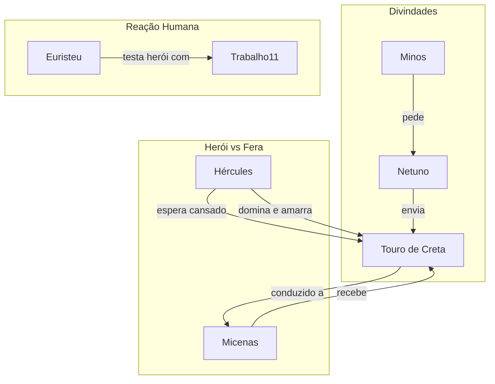

# 11. O TOURO DE CRETA

## Resumo

O sétimo trabalho de Hércules é capturar o temível Touro de Creta, um magnífico animal enviado por Netuno a pedido de Minos, mas que enlouqueceu e espalhou terror pelas ruas da ilha, até retornar ao mar para recuperar forças. Hércules aguarda a fera em terra firme, domando-a com sua confiança e habilidade. Quando o touro cansado emerge do mar, o herói o domina sem violência letal, amarrando-o e conduzindo-o vivo até Micenas, onde apresenta a Euristeu o quinto (décimo primeiro) trabalho cumprido.

## Hierarquias

## Objetivo

Capturar vivo o Touro de Creta, demonstrando domínio sobre as forças brutas e conduzindo-o a Mycenae.

## Quiz - 20250521_18:00:00

1. Quem solicitou o envio do Touro de Creta?

- a) Zeus
- b) Netuno
- c) Minos
- d) Euristeu

2. Por que o touro enlouqueceu?

- a) Foi ferido por Hércules
- b) Minos não cumpriu promessa a Netuno
- c) Enfureceu-se com as amazonas
- d) Fugiu do palácio

3. Qual era o local original do touro antes de ser capturado?

- a) Florestas de Creta
- b) Ruas da cidade de Creta
- c) Lago de Estínfalo
- d) Estábulos de Áugias

4. Como Hércules preparou sua abordagem?

- a) Escondeu-se na caverna
- b) Despediu-se dos pescadores
- c) Aguardou no ponto de saída do mar
- d) Construiu uma armadilha de madeira

5. O touro recuperava forças onde?

- a) No deserto de Líbia
- b) Nas montanhas de Trácia
- c) No mar, antes de retornar ao ataque
- d) Em Micenas

6. Como Hércules dominou o touro?

- a) Com veneno na lâmina
- b) Abraçando-o como um felino
- c) Amarrando-o com cordas após cansá-lo
- d) Assustando-o com um escudo

7. Para onde o touro foi levado após a captura?

- a) Atenas
- b) Micenas
- c) Delfos
- d) Creta

8. Quem recebeu o touro em Micenas?

- a) Mégara
- b) Euristeu
- c) Apolo
- d) Minos

9. Este trabalho exige principalmente:

- a) Força bruta e ferocidade
- b) Astúcia estratégica mas sem violência extrema
- c) Uso de armas mágicas
- d) Apoio de outros heróis

10. Qual lição deste trabalho reflete a maturidade do herói?

- a) Persistência sem limites
- b) Equilíbrio entre confiança e controle
- c) Dependência de presentes divinos
- d) Vingança impiedosa

### Respostas do Quiz

1. c) Minos — pediu o touro a Netuno em memória de seu pai.
2. b) Minos não cumpriu promessa a Netuno — causou a fúria do deus.
3. b) Ruas da cidade de Creta — o touro aterrorizava o povo.
4. c) Aguardou no ponto de saída do mar — estratégia para dominá-lo.
5. c) No mar, antes de retornar ao ataque — repunha suas energias.
6. c) Amarrando-o com cordas após cansá-lo — método não letal.
7. b) Micenas — local de apresentação a Euristeu.
8. b) Euristeu — foi quem recebeu o animal.
9. b) Astúcia estratégica mas sem violência extrema — domou a fera.
10. b) Equilíbrio entre confiança e controle — demonstração de crescimento.

## Challenge

Escreva em até 200 palavras como a captura do Touro de Creta simboliza o controle das paixões desenfreadas e a conquista do equilíbrio interno.

### Resposta do Challenge

A captura do Touro de Creta encarna a vitória do equilíbrio sobre a fúria incontrolável. O touro, força natural emanada por Netuno e desafiada pela falta de gratidão de Minos, personifica as paixões destemperadas que, quando não direcionadas, causam destruição. Hércules, ao esperar pacientemente e dominá-lo sem recorrer à violência mortal, demonstra que a verdadeira coragem inclui a gestão dos próprios impulsos e a condução do poder bruto em harmonia com a razão. Este trabalho reflete a jornada interna de quem, mesmo possuindo energia formidável, escolhe agir com moderação e autoridade equilibrada.

## Tarô

**Carta:** IV (O Imperador) — simboliza autoridade, estabilidade e autocontrole.
**Conceito de Krishnamurti:** Autodisciplina — observar e governar as próprias reações sem imposições externas.
