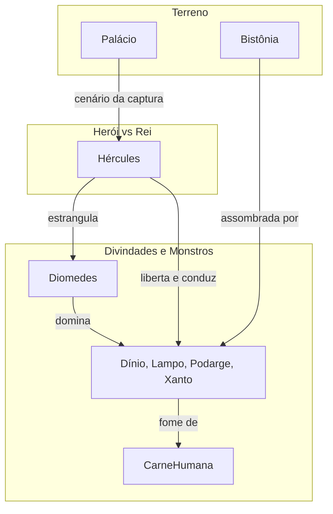

# 12. OS CAVALOS DE DIOMEDES

## Resumo

Após a frustrante fama de Domador de bestas, Hércules recebe o sétimo trabalho: capturar os cavalos de Diomedes, príncipes de Bistônia que lançam fogo pelas narinas e alimentam-se de carne humana. Ao chegar à cidade, ele presencia a carnificina dos habitantes e decide enfrentar a crueldade do rei. Durante o passeio diário das feras, Hércules lança-se sobre Diomedes, estrangula-o e, em seguida, lança seu corpo aos animais famintos, que o devoram. Libertos do impulso selvagem e saciados, os cavalos se acalmam e são conduzidos vivos a Micenas, comprovando o cumprimento do décimo segundo trabalho.

## Hierarquias

## Objetivo

Promover a redenção ao erradicar a crueldade de Diomedes, satisfazendo a fome bestial dos cavalos para depois domá-los e levá-los vivos a Euristeu.

## Quiz - 20250521_18:00:00

1. Quem era o rei dos cavalos maníacos em Bistônia?

- a) Netuno
- b) Diomedes
- c) Minos
- d) Euristeu

2. Quais nomes eram atribuídos aos cavalos de Diomedes?

- a) Fero, Medroso, Ágil e Ligeiro
- b) Dínio, Lampo, Podarge e Xanto
- c) Sileno, Fauno, Centauro e Quimera
- d) Cérbero, Hidra, Escila e Caríbdis

3. Qual era o banquete habitual dessas feras?

- a) Frutas silvestres
- b) Carne humana
- c) Ervas mágicas
- d) Ambrosia divina

4. Como Hércules amansou os cavalos?

- a) Tocando harpa
- b) Alimentando-os com carne de Diomedes
- c) Invocando Zeus
- d) Usando um elixir mágico

5. Onde ocorreu o confronto entre Hércules e Diomedes?

- a) No palácio de Creta
- b) Na margem do rio Ladão
- c) Dentro do palácio de Bistônia
- d) Em um templo abandonado

6. O que Hércules fez com o corpo de Diomedes?

- a) Enterrou-o em terra sagrada
- b) Devolveu-o aos deuses
- c) Lançou-o aos cavalos famintos
- d) Presentou-o a Euristeu

7. Qual mudança ocorreu nos cavalos após se saciarem?

- a) Fugiram para o mar
- b) Tornaram-se mansos
- c) Se multiplicaram
- d) Desapareceram em fumaça

8. Para onde os cavalos foram levados?

- a) Florestas de Estínfalo
- b) Estábulos de Áugias
- c) Palácio de Euristeu em Micenas
- d) Lago de Lerna

9. Este trabalho destaca principalmente:

- a) O poder da força bruta
- b) A importância da diplomacia
- c) O domínio das paixões bestiais
- d) A dependência de armadilhas

10. Qual aspecto reflete o aprendizado de Hércules neste capítulo?

- a) Paciência infindável
- b) Astúcia na batalha
- c) Equilíbrio entre compaixão e justiça
- d) Necessidade de ajuda divina

### Respostas do Quiz

1. b) Diomedes — rei cruel de Bistônia.
2. b) Dínio, Lampo, Podarge e Xanto — os quatro cavalos famintos.
3. b) Carne humana — prática habitual do monstro.
4. b) Alimentando-os com carne de Diomedes — tática para domá-los.
5. c) Dentro do palácio de Bistônia — local da captura.
6. c) Lançou-o aos cavalos famintos — libertando sua fúria.
7. b) Tornaram-se mansos — após se saciarem.
8. c) Palácio de Euristeu em Micenas — apresentação do trabalho.
9. c) O domínio das paixões bestiais — tema central.
10. c) Equilíbrio entre compaixão e justiça — lição aprendida.

## Challenge

Explique em até 200 palavras como a dominação dos cavalos de Diomedes simboliza a superação dos instintos mais primitivos e a afirmação da justiça.

### Resposta do Challenge

Ao confrontar Diomedes e alimentar suas feras com a carne do próprio tirano, Hércules transforma a fúria destrutiva em redenção: as feras, saciadas, deixam de atacar e aceitam o domínio humano. Esse gesto representa o triunfo sobre os impulsos cruéis e a reordenação moral, mostrando que a verdadeira justiça não só pune o mal, mas também neutraliza suas raízes, restaurando a ordem social.

## Tarô

**Carta:** XV (O Diabo) — simboliza impulsos, amarras e necessidade de libertação.
**Conceito de Krishnamurti:** Observar o desejo — reconhecer e transcender as cadeias internas que aprisionam a mente.
