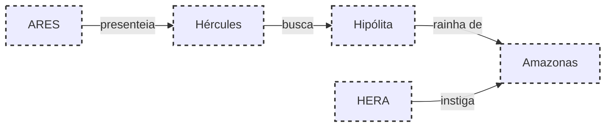

# 13.O CINTO DE HIPÓLITA

## Resumo

Após longas jornadas, Hércules chega às terras das Amazonas para obter o cinturão de Hipólita, presente de Ares. Inicialmente, a rainha acolhe o herói e oferece-lhe o objeto. No entanto, instigadas por Hera, as guerreiras acreditam numa traição e atacam. Hércules defende-se, captura o cinturão e parte rumo ao próximo desafio.

## Hierarquias

## Objetivo

Obter o cinturão de Hipólita sem sucumbir ao conflito instigado por Hera.

## Quiz (20231119_15:10:00)

1. Qual deus presenteou Hércules com o cinturão de Hipólita?
   a) Zeus
   b) Ares
   c) Hermes
   d) Apolo
   Resposta: b. Ares ofereceu o cinturão como símbolo de respeito.
2. Qual era o papel de Hipólita entre as Amazonas?
   a) Rainha
   b) Sacerdotisa
   c) Guerreiro líder
   d) Mensageira
   Resposta: a. Hipólita era a rainha das Amazonas.
3. Como Hércules chegou às terras das Amazonas?
   a) A pé
   b) De navio
   c) Em carruagem
   d) Por teletransporte
   Resposta: b. Cruzou o mar em uma nauta divina.
4. Qual era o símbolo do poder de Hipólita?
   a) Cinturão
   b) Espada
   c) Escudo
   d) Coroa
   Resposta: a. O cinturão representava sua autoridade.
5. Quem instigou as Amazonas contra Hércules?
   a) Hera
   b) Ares
   c) Zeus
   d) Hermes
   Resposta: a. Hera semeou desconfiança.
6. Qual foi a reação inicial das Amazonas?
   a) Acolher Hércules
   b) Ignorá-lo
   c) Atacá-lo
   d) Fugir
   Resposta: c. As Amazonas atacaram acreditando em traição.
7. Hércules defendeu-se usando qual arma?
   a) Arco
   b) Clava
   c) Escudo
   d) Espada
   Resposta: b. A clava foi sua principal arma.
8. O cinturão simbolizava principalmente:
   a) Força
   b) Sabedoria
   c) Amor
   d) Riqueza
   Resposta: a. Representava força de liderança.
9. Após obter o cinturão, Hércules:
   a) Continuou lutando
   b) Devolveu o cinturão
   c) Partiu
   d) Desistiu da missão
   Resposta: c. Partiu para o próximo trabalho.
10. Como Hera influenciou as Amazonas?
    a) Prometendo recompensas
    b) Disfarçando-se
    c) Instigando desconfiança
    d) Enviando pragas
    Resposta: c. Instigou desconfiança para provocar o conflito.

## Challenge

**Prompt:** Escreva um diálogo no qual Hércules tenta explicar suas intenções a Hipólita após o confronto, explorando temas de confiança e mal-entendido.
**Resposta:**
Hércules: Gloriosa Hipólita, minha vinda não foi para saque ou guerra, mas para honrar nossa aliança e receber o símbolo de tua confiança. Hipólita: No entanto, minhas guerreiras temeram traição e me imploraram que as protegesse. Hércules: Compreendo que a dúvida brotou por instigação divina, mas meu coração permanece limpo. Que este cinturão seja testemunha de nossa verdade mútua e de meu compromisso em cumprir tua vontade.

## Tarô e Krishnamurti

**Carta de Tarô:** A Força (VIII), simbolizando coragem e domínio dos instintos.
**Conceito de J. Krishnamurti:** A importância de observar sem julgamento as reações provocadas pelos outros, evitando o conflito interior.
