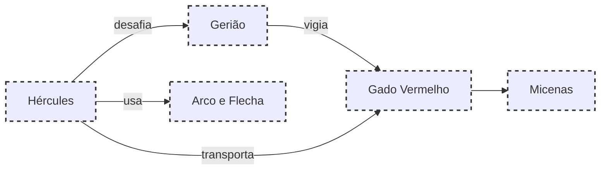

# 14.O REBANHO DE GERIÃO

## Resumo

Hércules atravessa o Oceano Ocidental rumo às terras de Gerião, um gigante de três corpos que guardava um valioso rebanho de gado vermelho. Após fundir a cabeça do gigante a flechadas e usar sua força contra os três corpos, o herói conquista o rebanho e inicia o retorno a Micenas.

## Hierarquias

## Objetivo

Capturar o rebanho de Gerião e levar os animais vivos até Euristeu.

## Quiz (20231119_15:20:00)

1. Quem era Gerião?
   a) Um centauro
   b) Um gigante tricorpor
   c) Um deus marinho
   d) Um rei heleno
   Resposta: b. Gerião tinha três corpos unidos na cintura.
2. Qual era a cor do gado de Gerião?
   a) Branco
   b) Azul
   c) Vermelho
   d) Negro
   Resposta: c. O rebanho era de gado vermelho.
3. Qual arma Hércules usou para ferir Gerião?
   a) Espada
   b) Clava
   c) Arco e flecha
   d) Lança
   Resposta: c. Utilizou o arco depois de esgotar a clava.
4. Quantos corpos Gerião possuía?
   a) Um
   b) Dois
   c) Três
   d) Quatro
   Resposta: c. Três corpos compartilhavam um par de pernas.
5. Onde Hércules levou o rebanho?
   a) Larissa
   b) Tebas
   c) Micenas
   d) Atenas
   Resposta: c. Levou-o até o palácio de Euristeu em Micenas.
6. Por que o gado de Gerião era especial?
   a) Produzia leite mágico
   b) Era indestrutível
   c) Brilhava à noite
   d) Crescia em estatura
   Resposta: a. Seu leite tinha propriedades curativas.
7. Além das flechadas, o que Hércules usou na luta?
   a) Rede
   b) Rocha
   c) Fogo divino
   d) Clava
   Resposta: d. Empunhou a clava para derrubar o primeiro corpo.
8. Qual divindade auxiliou Hércules nesta tarefa?
   a) Atena
   b) Gaia
   c) Apolo
   d) Nenhuma diretamente
   Resposta: d. Foi puramente força e astúcia.
9. Qual era o destino final do rebanho?
   a) Devolução a Gerião
   b) Sacrifício a Hera
   c) Entrega a Euristeu
   d) Venda em Corinto
   Resposta: c. Euristeu queria usá-lo como troféu.
10. Qual obstáculo natural Hércules enfrentou?
    a) Tempestade no mar
    b) Labirinto
    c) Floresta encantada
    d) Poço sem fundo
    Resposta: a. Enfrentou ventos fortes no Oceano.

## Challenge

**Prompt:** Descreva o momento em que Hércules percebe a vastidão do rebanho de Gerião e reflete sobre o peso de sua missão.
**Resposta:**
Hércules parou no alto da duna, o vento salgado embalando a relva onde pastava o gado vermelho. Cada boi parecia pulsar energia bruta, memória viva de um gigante desafiado. Ao tocar o arado que amarrava o primeiro touro, sentiu o peso não só da madeira, mas do mundo que carregava. Pensou nas vidas marcadas por seu triunfo: o gado que seguiria para Micenas, a fome saciada, e o medo dissipado. Ainda assim, o canto distante de gaivotas lembrava-lhe que a jornada não terminara. A cada passo, o peso do dever se tornava mais denso, e o herói compreendeu que nenhuma força seria maior que o compromisso com o princípio que abraçara.

## Tarô e Krishnamurti

**Carta de Tarô:** O Carro (VII), representando a vontade invencível e o controle dos desafios.
**Conceito de J. Krishnamurti:** A necessidade de manter a mente firme sem se deixar atropelar pelos obstáculos externos.
