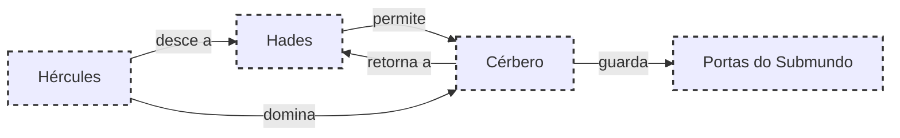

# 15.O GUARDIÃO DOS INFERNOS

## Resumo

Em sua última prova, Hércules desce ao reino de Hades para capturar Cérbero, o cão de três cabeças guardião das portas do submundo. Com permissão de Plutão, desarma-se e enfrenta o monstro com as próprias mãos, domando suas três cabeças e mostrando-o a Euristeu antes de devolvê-lo a seu lugar.

## Hierarquias

## Objetivo

Capturar Cérbero sem o uso de armas e obedecer às condições impostas pelo deus do submundo.

## Quiz (20231119_15:30:00)

1. Quem é Cérbero?
   a) Um centauro
   b) Um cão de três cabeças
   c) Um titã
   d) Um dragão
   Resposta: b. Cérbero é o cão guardião do submundo.
2. Qual deus autorizou Hércules a levar Cérbero?
   a) Zeus
   b) Hades
   c) Ares
   d) Poseidon
   Resposta: b. Hades (Plutão) concedeu permissão.
3. Onde vivia Cérbero?
   a) Monte Olimpo
   b) Alpes
   c) Submundo
   d) Labirinto
   Resposta: c. No reino de Hades.
4. Quantas cabeças possui Cérbero?
   a) Uma
   b) Duas
   c) Três
   d) Quatro
   Resposta: c. Três cabeças simbolizam nascimento, vida e morte.
5. Que condição Hades impôs a Hércules?
   a) Usar arco
   b) Levar o cão vivo sem feri-lo
   c) Matar uma cabeça
   d) Deixar o submundo em silêncio
   Resposta: b. Capturar o cão vivo e sem arma.
6. Como Hércules dominou Cérbero?
   a) Mágica
   b) Rede
   c) Força manual
   d) Espada sagrada
   Resposta: c. Usou sua força para conter o animal.
7. Por que Euristeu temia Cérbero?
   a) Era venenoso
   b) Era invencível
   c) Guardava o poder dos mortos
   d) Podia ressuscitar mortos
   Resposta: c. Guardava a porta do submundo e os segredos da morte.
8. O que Hércules fez após mostrar Cérbero a Euristeu?
   a) Matou-o
   b) Libertou-o
   c) Devolveu-o a Hades
   d) Vendeu-o
   Resposta: c. Devolveu-o ao submundo.
9. Qual sentimento Hércules enfrentou no submundo?
   a) Alegria
   b) Desespero
   c) Medo
   d) Indiferença
   Resposta: c. O medo dos mortos e do desconhecido.
10. A captura de Cérbero simboliza:
    a) Triunfo sobre o caos
    b) Derrota dos titãs
    c) União dos mundos
    d) Início de uma nova era
    Resposta: a. Controle sobre as forças ocultas.

## Challenge

**Prompt:** Escreva um monólogo interior de Hércules ao enfrentar as três cabeças de Cérbero, explorando o equilíbrio entre coragem e compaixão.
**Resposta:**
Hércules sentiu o chão tremer ao ouvir os rosnados de cada cabeça. O ar tornou-se frio, carregado de memórias dos mortos. Em cada máscara de dentição, viu o reflexo do próprio medo e da vontade de triunfar. Levantou os braços, não para golpear, mas para conter. Suas mãos firmes tocaram o pelo áspero, buscando empatia naquele ser feral. O conflito interno foi maior que a luta física: resistir ao impulso de destruir e optar por curvar-se com respeito. Cada protesto da fera era um eco da escuridão humana, mas Hércules permaneceu inabalável, provando que a força mais pura nasce da compaixão.

## Tarô e Krishnamurti

**Carta de Tarô:** O Eremita (IX), simbolizando introspecção e sabedoria interior.
**Conceito de J. Krishnamurti:** A importância de observar sem medo as próprias sombras, evitando ações impulsivas.
