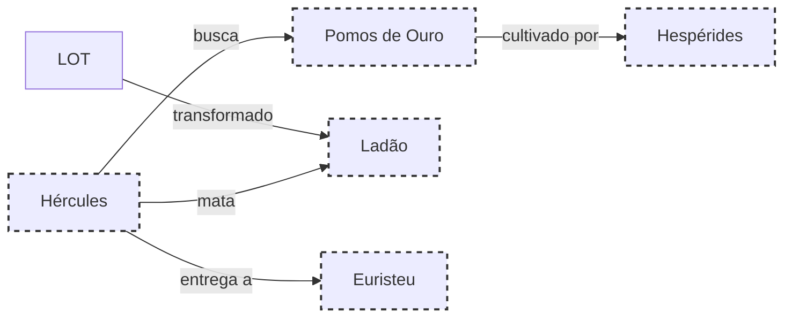

# 16.OS POMOS DE OURO

## Resumo

O último trabalho leva Hércules ao Jardim das Hespérides, onde cresciam os lendários pomos de ouro. Após superar guardiãs e dragão Ladão, o herói obtém os frutos, entregando-os a Euristeu.

## Hierarquias

## Objetivo

Colher os pomos de ouro do jardim sagrado e trazê-los vivos a Euristeu.

## Quiz (20231119_15:40:00)

1. Onde ficava o Jardim das Hespérides?
   a) No Olimpo
   b) No Mundo Subterrâneo
   c) No Ocidente distante
   d) Na Trácia
   Resposta: c. Localizava-se no Ocidente distante.
2. Quem cuidava dos pomos de ouro?
   a) Hespérides
   b) Ninfas do mar
   c) Amazonas
   d) Musas
   Resposta: a. Eram protegidos pelas Hespérides.
3. Qual criatura guardava o jardim?
   a) Ciclopes
   b) Ladão
   c) Quimera
   d) Hidra
   Resposta: b. Ladão, o dragão de cem cabeças.
4. O que representavam os pomos de ouro?
   a) Imortalidade
   b) Beleza
   c) Conhecimento
   d) Fertilidade
   Resposta: d. Símbolo de fertilidade e abundância.
5. Como Hércules superou Ladão?
   a) Arco e flecha
   b) Golpe direto
   c) Estratégia de distração
   d) Negociação
   Resposta: b. Derrotou-o com um golpe poderoso.
6. Qual divindade assistiu Hércules?
   a) Hera
   b) Gaia
   c) Athena
   d) Nenhuma diretamente
   Resposta: d. Conteve-se a usar força e astúcia.
7. Quantos pomos foram colhidos?
   a) Cinco
   b) Sete
   c) Nove
   d) Dez
   Resposta: b. Colheu sete pomos dourados.
8. Após colher os pomos, Hércules:
   a) Comeram um no local
   b) Queimou o jardim
   c) Levou-os vivos a Euristeu
   d) Devolveu-os a Hera
   Resposta: c. Transportou sete pomos para Euristeu.
9. O Jardim das Hespérides era protegido por:
   a) Um labirinto
   b) Uma muralha invisível
   c) Uma névoa mágica
   d) Nenhum obstáculo físico
   Resposta: c. Havia névoas que ocultavam o local.
10. A obtenção dos pomos simboliza:
    a) Fim dos trabalhos
    b) Início de uma viagem
    c) Retorno ao lar
    d) Transformação interior
    Resposta: a. Culminação dos doze trabalhos.

## Challenge

**Prompt:** Escreva uma descrição sensorial do momento em que Hércules colhe o primeiro pomo de ouro, focando em cores, texturas e emoções.
**Resposta:**
Hércules estendeu a mão e sentiu a casca lisa e fria do pomo cintilante. A luz ocidental refletia tons de âmbar nos sulcos dourados, e um aroma doce e terroso subiu, lembrando mel e sais do mar. Seu coração pulsou num ritmo ancestral, misturando deleite e reverência. Cada nervura no fruto parecia pulsar benevolência, e ao destacá-lo do galho, ouviu o sussurro distante das águas, testemunhas silentes do momento mágico. O pomo, ainda quente ao toque, trouxe a promessa de término e renascimento.

## Tarô e Krishnamurti

**Carta de Tarô:** O Mundo (XXI), representando integração e conclusão bem-sucedida.
**Conceito de J. Krishnamurti:** A compreensão de que o fim de uma jornada é o início de uma nova etapa, exigindo percepção contínua.
