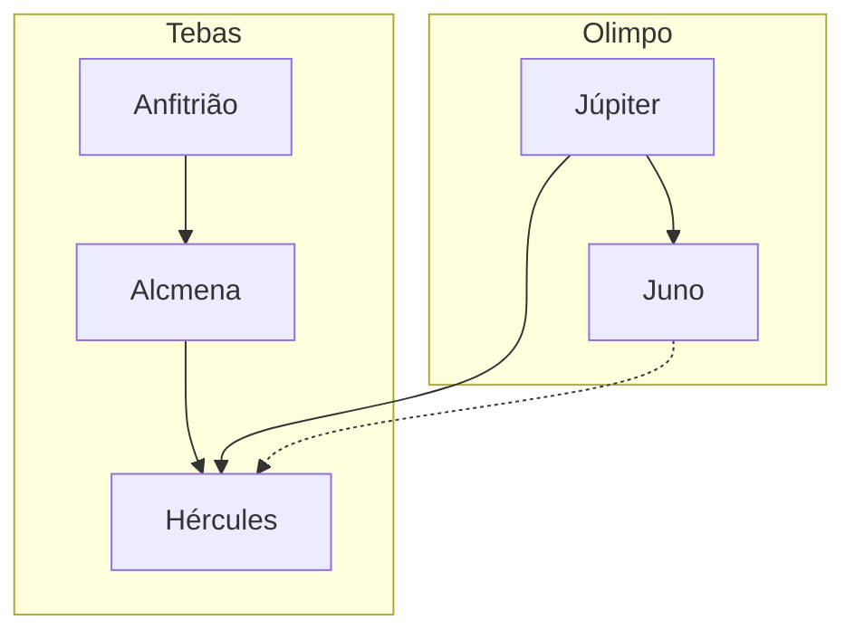

**Resumo**
O capítulo "Uma Infância de Herói" narra os eventos que cercam o nascimento e os primeiros anos de Hércules. Desde o momento em que Júpiter, disfarçado como Anfitrião, visita Alcmena, até a revelação de sua verdadeira identidade e o nascimento de Hércules, o capítulo explora a intervenção divina e os desafios enfrentados por Alcmena e Anfitrião. A infância de Hércules é marcada por sua força extraordinária e por eventos que prenunciam seu destino como herói.

**Hierarquias**

**Objetivo**
Este capítulo não descreve diretamente um dos trabalhos de Hércules, mas estabelece as bases para sua jornada heroica. A importância está em apresentar sua origem divina e os conflitos que moldarão sua vida, como a rivalidade com Juno e a expectativa de grandes feitos.

**Quiz**
*Quiz - 20250511_15:30:00*
1. Quem era o pai biológico de Hércules?
   - a) Anfitrião
   - b) Júpiter
   - c) Filo
   - d) Rei de Micenas

2. Como Júpiter visitou Alcmena?
   - a) Disfarçado como Anfitrião
   - b) Como um raio de luz
   - c) Como um cisne
   - d) Como um touro

3. Qual foi a reação de Juno ao descobrir a traição de Júpiter?
   - a) Indiferença
   - b) Cólica de raiva
   - c) Planejou vingança contra Hércules
   - d) Perdoou Júpiter

4. Qual era o destino de Hércules, segundo Júpiter?
   - a) Tornar-se rei de Tebas
   - b) Libertar os humanos dos males
   - c) Ser um deus do Olimpo
   - d) Ser um guerreiro comum

5. Quem criou Hércules durante sua infância?
   - a) Júpiter e Juno
   - b) Alcmena e Anfitrião
   - c) Filo
   - d) O rei de Micenas

6. Qual foi o papel de Juno na infância de Hércules?
   - a) Proteger Hércules
   - b) Tentar prejudicá-lo
   - c) Ignorá-lo
   - d) Criá-lo como seu próprio filho

7. O que marcou a infância de Hércules?
   - a) Sua força extraordinária
   - b) Sua inteligência
   - c) Sua habilidade musical
   - d) Sua liderança

8. Qual foi a reação de Anfitrião ao saber da visita de Júpiter?
   - a) Ficou honrado
   - b) Ficou furioso
   - c) Ficou indiferente
   - d) Ficou confuso

9. Como Alcmena reagiu ao saber da verdade sobre Júpiter?
   - a) Com alegria
   - b) Com medo
   - c) Com raiva
   - d) Com resignação

10. Qual é o tema principal deste capítulo?
    - a) A guerra entre Tebas e os telebeus
    - b) A origem divina de Hércules
    - c) A traição de Alcmena
    - d) A liderança de Anfitrião

**Respostas:**
1. b) Júpiter
2. a) Disfarçado como Anfitrião
3. c) Planejou vingança contra Hércules
4. b) Libertar os humanos dos males
5. b) Alcmena e Anfitrião
6. b) Tentar prejudicá-lo
7. a) Sua força extraordinária
8. b) Ficou furioso
9. d) Com resignação
10. b) A origem divina de Hércules

**Challenge**
Explique como a origem divina de Hércules influenciou sua infância e os desafios que ele enfrentou. Relacione isso com os eventos narrados no capítulo.

**Resposta:**
A origem divina de Hércules, sendo filho de Júpiter, trouxe-lhe dons extraordinários, como força sobre-humana, mas também atraiu a ira de Juno, que tentou prejudicá-lo desde cedo. Esses eventos moldaram sua infância e prepararam-no para os desafios futuros, destacando o papel dos deuses na vida dos mortais e o destino heroico de Hércules.